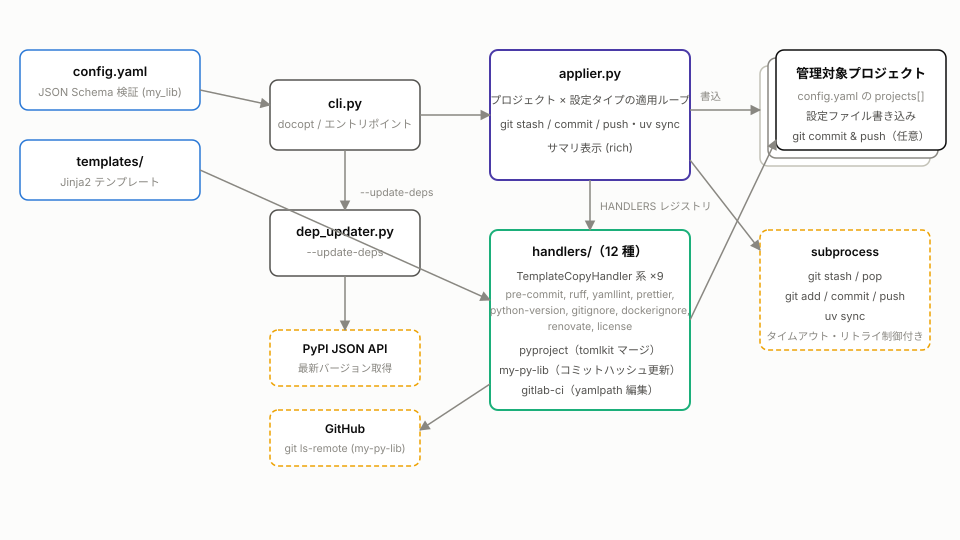
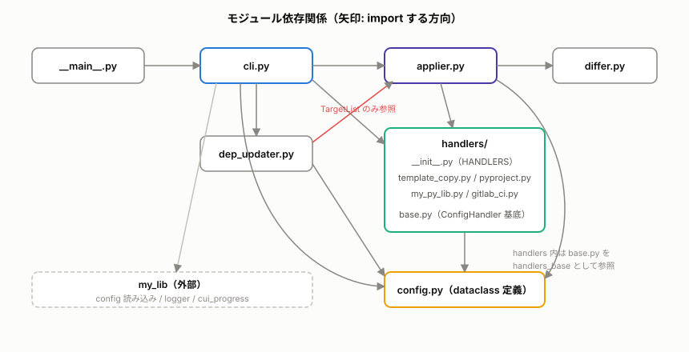
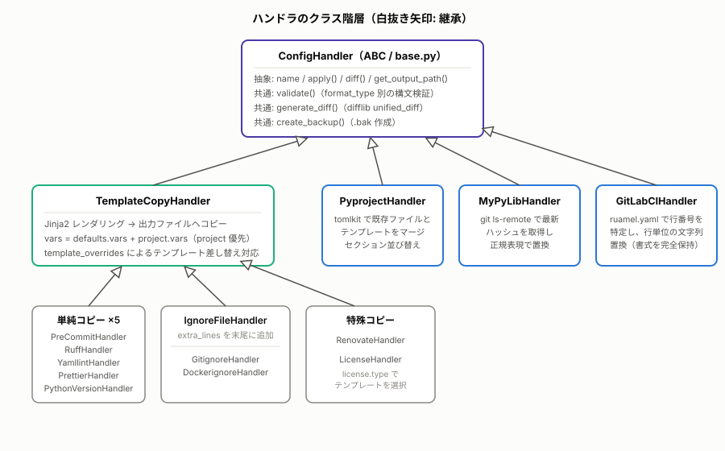
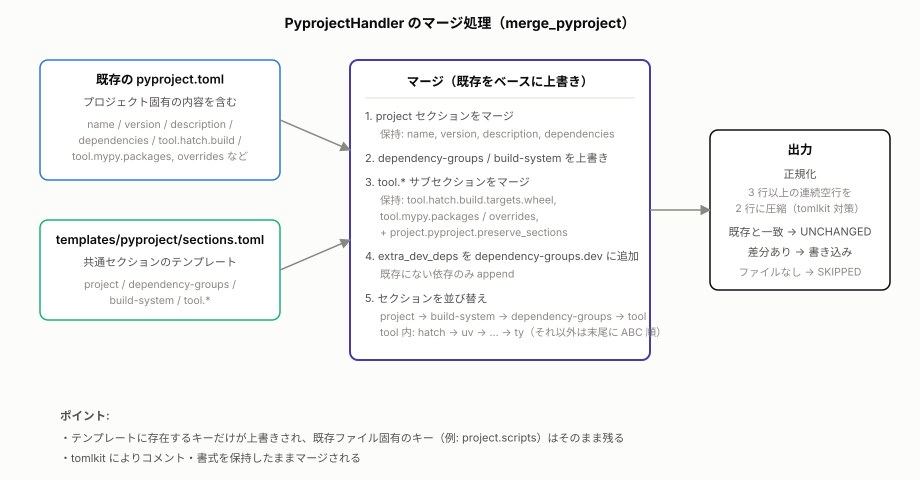
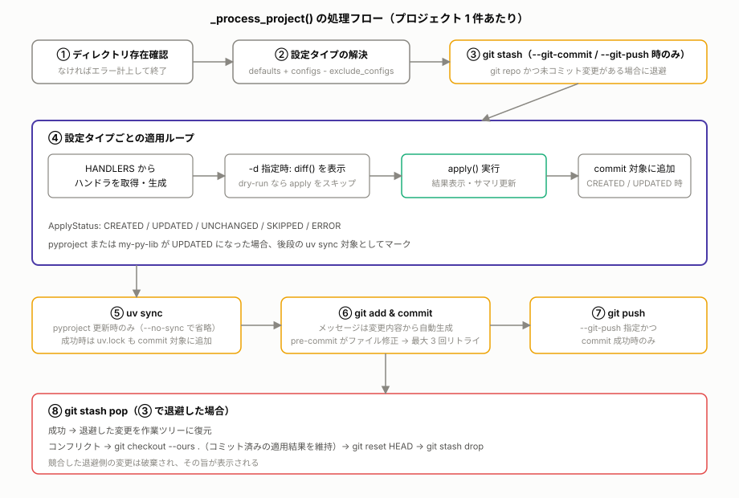
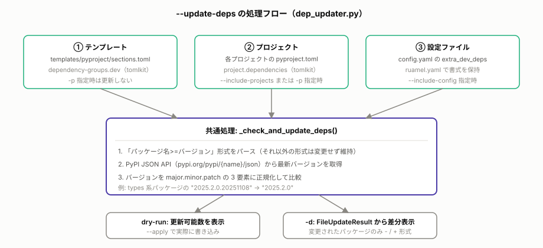

# アーキテクチャ

py-project は、複数の Python プロジェクトに標準的な設定ファイル（pre-commit, ruff, pyproject.toml 等）を一括適用する CLI ツールです。本ドキュメントでは、実装コードに基づいて内部構造を説明します。

## 全体像

`config.yaml`（管理対象プロジェクトの定義）と `templates/`（設定ファイルのテンプレート）を入力として、CLI → 適用エンジン（applier）→ 設定タイプ別ハンドラという流れで各プロジェクトへ設定を書き込みます。



外部との接点は次の 3 系統です。

| 接点                      | 使用箇所                | 目的                                          |
| ------------------------- | ----------------------- | --------------------------------------------- |
| subprocess (`git`, `uv`)  | `applier.py`            | stash / add / commit / push、`uv sync` の実行 |
| `git ls-remote`（GitHub） | `handlers/my_py_lib.py` | my-py-lib の最新コミットハッシュ取得          |
| PyPI JSON API             | `dep_updater.py`        | 依存パッケージの最新バージョン取得            |

## ディレクトリ構成

```
src/py_project/
├── __main__.py             # エントリポイント（cli.main を呼ぶだけ）
├── cli.py                  # CLI（docopt）・サブコマンド分岐
├── config.py               # 設定 dataclass 定義（dacite で辞書から変換）
├── applier.py              # 適用エンジン（適用ループ・git 連携・サマリ表示）
├── differ.py               # 差分のシンタックスハイライト表示（rich）
├── dep_updater.py          # --update-deps の依存バージョン更新
└── handlers/               # 設定タイプ別ハンドラ
    ├── __init__.py         # HANDLERS レジストリ（設定タイプ名 → ハンドラクラス）
    ├── base.py             # ConfigHandler 基底クラス・共通型
    ├── template_copy.py    # テンプレートコピー系ハンドラ（9 種）
    ├── pyproject.py        # pyproject.toml マージハンドラ
    ├── my_py_lib.py        # my-py-lib 依存ハッシュ更新ハンドラ
    └── gitlab_ci.py        # .gitlab-ci.yml 編集ハンドラ

schema/config.schema        # config.yaml の JSON Schema（draft-07）
templates/<設定タイプ>/     # 各設定タイプのテンプレート（Jinja2 対応）
tests/unit/                 # ユニットテスト
tests/integration/          # インテグレーションテスト（applier 中心）
```

## モジュール依存関係



- `cli.py` が各モジュールを束ねるトップレベルです。
- `handlers/` の各ハンドラは循環インポート回避のため `import py_project.handlers.base as handlers_base` の形式で基底モジュールを参照します（それ以外は `import py_project.config` のようにモジュール単位でインポートするのがこのリポジトリの規約です）。
- `dep_updater.py` は型エイリアス `TargetList` の参照のためだけに `applier` を import しています。
- 設定読み込み（スキーマ検証付き）・ロギング初期化・プログレス表示は外部ライブラリ `my_lib`（[my-py-lib](https://github.com/kimata/my-py-lib)）を利用します。

### 主要な型

| 型                                | 定義場所           | 内容                                                                              |
| --------------------------------- | ------------------ | --------------------------------------------------------------------------------- |
| `Config` / `Defaults` / `Project` | `config.py`        | config.yaml に対応する dataclass。`Config.from_dict()` が dacite でネストごと変換 |
| `ApplyOptions`                    | `config.py`        | dry_run / backup / show_diff / run_sync / git_commit / git_push                   |
| `ApplyContext`                    | `handlers/base.py` | ハンドラに渡すコンテキスト（config, template_dir, dry_run, backup）               |
| `ApplyResult` / `ApplyStatus`     | `handlers/base.py` | 適用結果。ステータスは CREATED / UPDATED / UNCHANGED / ERROR / SKIPPED の Enum    |
| `ApplySummary` / `ChangeDetail`   | `applier.py`       | 実行全体の集計とサマリ表示用の変更明細                                            |
| `ProgressType`                    | `applier.py`       | `ProgressManager \| NullProgressManager` の TypeAlias（Null Object パターン）     |
| `TargetList`                      | `applier.py`       | `list[str] \| None`（-p / -t の対象リスト）                                       |

## CLI の実行フロー

`cli.py` の `main()` は docopt で引数を解析し、次の順で分岐します。

1. `--list-configs` → `HANDLERS` レジストリの設定タイプ一覧を表示して終了
2. `my_lib.config.load()` で config.yaml を読み込み（`schema/config.schema` による JSON Schema 検証。失敗時はエラー種別ごとにメッセージを表示して終了）
3. `--validate` → 検証成功を表示して終了
4. `Config.from_dict()` で dataclass に変換
5. `--list-projects` → プロジェクト一覧を表示して終了（適用ロジックと同じ `applier.get_project_configs()` で設定タイプを解決して表示）
6. `--update-deps` → `dep_updater` による依存更新（後述）
7. それ以外 → `ApplyOptions` を組み立てて `applier.apply_configs()` を実行

`--apply` を指定しない限り dry-run（確認モード）で動作します。終了コードにはエラー件数（`ApplySummary.errors`）がそのまま使われます。

## ハンドラアーキテクチャ

設定タイプごとの処理は `ConfigHandler`（ABC）を継承したハンドラとして実装され、`handlers/__init__.py` の `HANDLERS` 辞書（設定タイプ名 → クラス）に登録されます。applier はこのレジストリ経由でのみハンドラを参照するため、新しい設定タイプの追加は「ハンドラクラスの実装 + レジストリ登録」で完結します。



### ConfigHandler 基底クラス（`handlers/base.py`）

- 抽象メンバ: `name`（設定タイプ名）、`apply()`、`diff()`、`get_output_path()`
- `validate(content)`: クラス属性 `format_type`（YAML / TOML / JSON / TEXT の Enum）に応じて `yaml.safe_load` / `tomlkit.parse` / `json.loads` で構文検証し、`ValidationResult` を返す
- `generate_diff()`: `difflib.unified_diff` による unified diff 生成（変更なしなら None）
- `create_backup()`: 適用前バックアップ（`元ファイル名 + .bak`）

### 各ハンドラの実装方式

| ハンドラ                                                                                        | 方式                                                                                                                                                                                                                                                                                                                                               |
| ----------------------------------------------------------------------------------------------- | -------------------------------------------------------------------------------------------------------------------------------------------------------------------------------------------------------------------------------------------------------------------------------------------------------------------------------------------------- |
| `TemplateCopyHandler` 系（pre-commit, ruff, yamllint, prettier, python-version, renovate ほか） | テンプレートを Jinja2 でレンダリングし、出力ファイルと比較して差分があれば書き込み。テンプレート変数は `{**defaults.vars, **project.vars}`（プロジェクト優先）に加え、`project` / `defaults` オブジェクト自体も参照可能。`project.template_overrides` でテンプレートファイル自体を差し替え可能                                                     |
| `IgnoreFileHandler`（gitignore, dockerignore, ruff）                                            | 上記に加えて、プロジェクト設定の `extra_lines` をレンダリング結果の末尾に追加。ruff ではプロジェクト固有の TOML セクション（例: `[lint.per-file-ignores]`）の追記に使用（TOML はセクション順不問のため末尾追記で等価）                                                                                                                             |
| `LicenseHandler`                                                                                | `project.license.type`（デフォルト Apache-2.0）と同名のテンプレートファイルを選択して LICENSE を生成                                                                                                                                                                                                                                               |
| `PyprojectHandler`                                                                              | 既存の pyproject.toml とテンプレート `sections.toml` を tomlkit でマージ（下図参照）。対象ファイルが存在しない場合は SKIPPED                                                                                                                                                                                                                       |
| `MyPyLibHandler`                                                                                | pyproject.toml 内の `my-lib @ git+https://github.com/kimata/my-py-lib@<hash>` を正規表現で検出し、`git ls-remote` で取得した最新コミットハッシュ（40 桁の 16 進数であることを検証）に置換                                                                                                                                                          |
| `GitLabCIHandler`                                                                               | config.yaml の `gitlab_ci.edits`（`/image` のようなスラッシュ区切りパスと値の組）に従い、ruamel.yaml で対象キーの行番号を特定して**行単位の文字列置換**を行う。YAML を再シリアライズしないため既存の書式・コメントが完全に保持される。edits は defaults とプロジェクト設定をパスをキーにマージ（プロジェクト優先）し、値は Jinja2 で `vars` を展開 |

### pyproject.toml のマージ処理

`PyprojectHandler.merge_pyproject()` は「既存ファイルをベースに、テンプレートに存在するキーだけを上書きする」方針です。プロジェクト固有の情報は保持リストによって守られます。



- 常に保持されるフィールド: `project.name` / `version` / `description` / `dependencies`
- 常に保持されるセクション: `tool.hatch.build.targets.wheel`, `tool.mypy.packages`, `tool.mypy.overrides`（＋プロジェクト設定の `pyproject.preserve_sections`）
- `pyproject.extra_dev_deps` は `dependency-groups.dev` に追記（既存にない依存のみ）
- マージ後、トップレベルセクションを `project → build-system → dependency-groups → tool` の順、`tool.*` サブセクションを `hatch → uv → uv-dynamic-versioning → ruff → pytest → coverage → mypy → pyright → ty` の順に並び替え（リスト外はアルファベット順で末尾）
- tomlkit の再シリアライズで空行が増殖する対策として、3 行以上の連続空行を 2 行へ正規化してから既存内容と比較

## 適用エンジン（applier.py）

`apply_configs()` が全体のオーケストレーションを行い、プロジェクトごとに `_process_project()` を呼び出します。



- **設定タイプの解決**: `get_project_configs()` が `defaults.configs` をベースに `project.configs` を追加（重複排除）、`project.exclude_configs` を除外して適用対象を決定します。
- **-p / プロジェクト検証**: 指定されたプロジェクト名が config.yaml に存在しない場合は警告し、`difflib.get_close_matches` で類似候補を提示します。
- **進捗表示**: プロジェクト全体と設定タイプごとの 2 段のプログレスバーを `my_lib.cui_progress` で表示します。`progress` が渡されない場合は `NullProgressManager` に差し替える Null Object パターンで、内部処理から None チェックを排除しています。

### git 連携（--git-commit / --git-push）

1. **stash**: 対象が git リポジトリで、追跡ファイルに未コミット変更（`git status --porcelain -uno`）がある場合、適用前に `git stash push` で退避
2. **commit**: CREATED / UPDATED になったファイルを `git add` し、変更内容から自動生成したメッセージ（1 行目 `chore: 設定ファイルを更新` + ファイルごとの明細）でコミット。pre-commit フックがファイルを修正して失敗した場合（`files were modified by this hook` を検出）は再 add して最大 3 回リトライ
3. **uv sync**: `pyproject` または `my-py-lib` が UPDATED の場合に実行（`--no-sync` で省略）。成功時は `uv.lock` もコミット対象に加え、コミットメッセージには新旧 uv.lock のパース結果（`[[package]]` の name / version）から「追加 / 更新 / 削除」されたパッケージ名を記載
4. **push**: `--git-push` 指定かつコミット成功時のみ実行
5. **stash pop**: 退避していた変更を復元。コンフリクト時は `git checkout --ours .`（コミット済みの適用結果を維持）→ `git reset HEAD` → `git stash drop` でクリーンアップし、退避側の変更が破棄された旨を表示

git commit は pre-commit フックが子プロセスを生成するため、通常の `subprocess.run` ではなく `_run_subprocess_with_group_kill()` を使用します。これは `start_new_session=True` で起動し、タイムアウト時に `os.killpg` で**プロセスグループごと** SIGKILL することで、フックの子プロセスがパイプを保持してハングするのを防ぎます。各サブプロセスにはタイムアウトが設定されています（commit: 300 秒、uv sync: 120 秒、push: 60 秒、stash 系: 30 秒）。

## 依存関係更新（--update-deps / dep_updater.py）

pre-commit や pytest などの開発依存のバージョンを PyPI の最新に引き上げる機能です。更新対象は 3 種類あり、いずれも共通のチェック処理を通ります。



- 依存文字列は `パッケージ名>=バージョン` 形式のみパース対象で、それ以外の形式は変更されません。
- 取得した最新バージョンは `major.minor.patch` の 3 要素に正規化して比較します（`types-*` パッケージの日付付き 4 要素バージョン対策）。
- TOML の書き換えは tomlkit（複数行配列を維持）、config.yaml の書き換えは ruamel.yaml（クォート・インデント保持）で行い、いずれも既存の書式を保ちます。
- 更新結果は `FileUpdateResult`（更新前後の内容と `DepUpdate` のリスト）として返り、`-d` 指定時に差分表示へ使われます。

## 出力・差分表示

- コンソール出力は rich を使用し、適用結果は記号付き（`+` 作成 / `~` 更新 / `✓` 変更なし / `-` スキップ / `!` エラー）で 1 行ずつ表示されます。
- 実行終了時に統計テーブル・変更明細・エラー一覧・経過時間をまとめたサマリパネルを表示します。変更明細テーブルはコンソール幅 80 桁以上の場合のみ表示され、明細に含まれないエラー（例: プロジェクトディレクトリ欠落）は別途エラー一覧として必ず表示されます。
- `differ.py` は unified diff を rich の `Syntax`（diff / monokai テーマ）でハイライト表示します。

## テスト構成

- `tests/unit/`: モジュール単位のテスト（cli / config / differ / dep_updater / 各ハンドラ）
- `tests/integration/test_applier.py`: applier の適用ループ・git 連携（subprocess はモック）・サマリ表示のテスト
- `tests/conftest.py`: 一時プロジェクト・一時テンプレートなどの共通フィクスチャ

CI（`.gitlab-ci.yml` / GitHub Actions）では pytest に加えて pyright / mypy の型チェックを実行します。ty を含む 3 つの型チェッカーは pre-commit フックでも実行されます。
